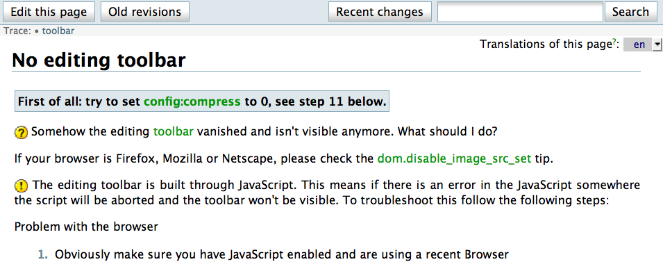
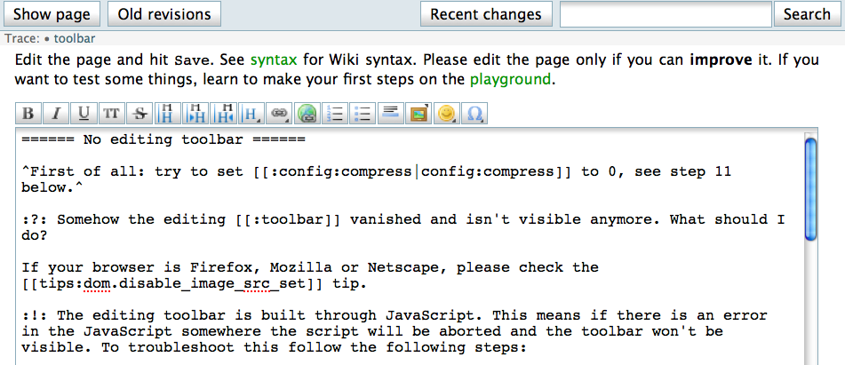
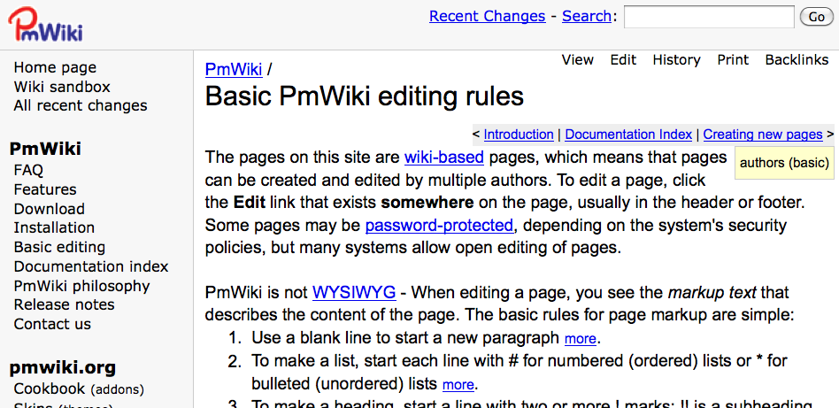
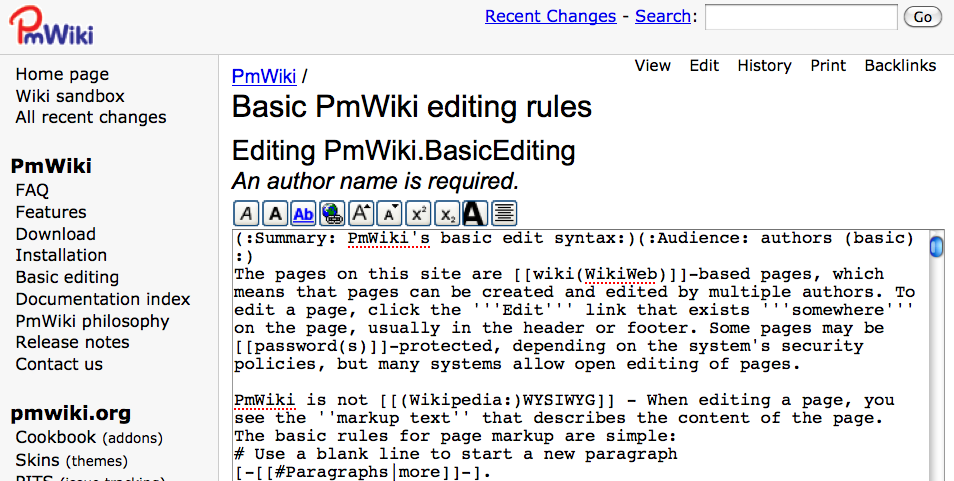
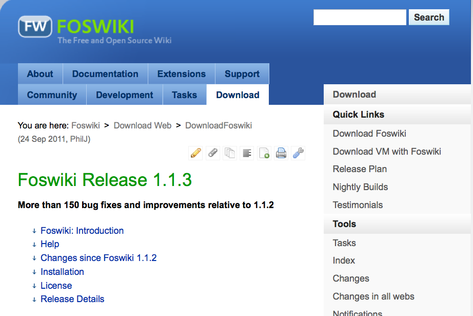
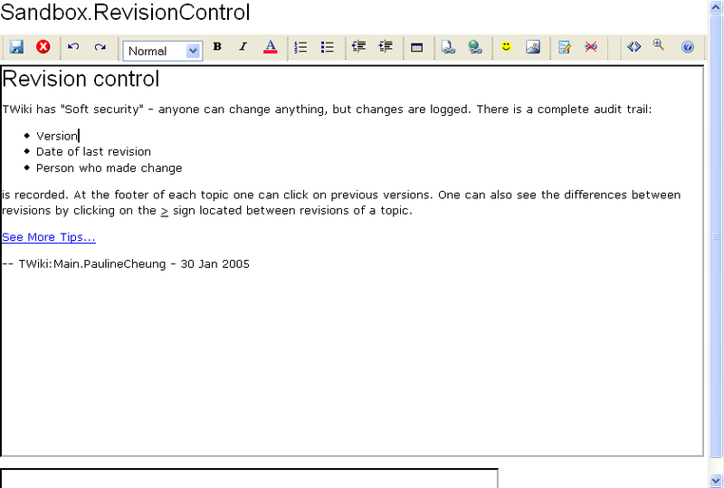

!SLIDE bullets incremental
# Requirements #
* Intuitively easy to use for non-technical users
* Minimal setup and maintenance costs for us
* Hostable on our own infrastructure

!SLIDE center
# DokuWiki #

!SLIDE center
# DokuWiki #

!SLIDE center
# PmWiki #

!SLIDE center
# PmWiki #

!SLIDE
# Both DokuWiki and PmWiki are PHP wikis using flat files for storage. #

!SLIDE center
# Foswiki (Twiki) #

!SLIDE center
# Foswiki (Twiki) #

!SLIDE
# FosWiki also uses flat files for storage. #

!SLIDE bullets incremental
* Requires a number of Perl modules
* Uses RCS for tracking versions
* Has arcane requirements (e.g. no spaces in directories)
* Only has good support for Apache

